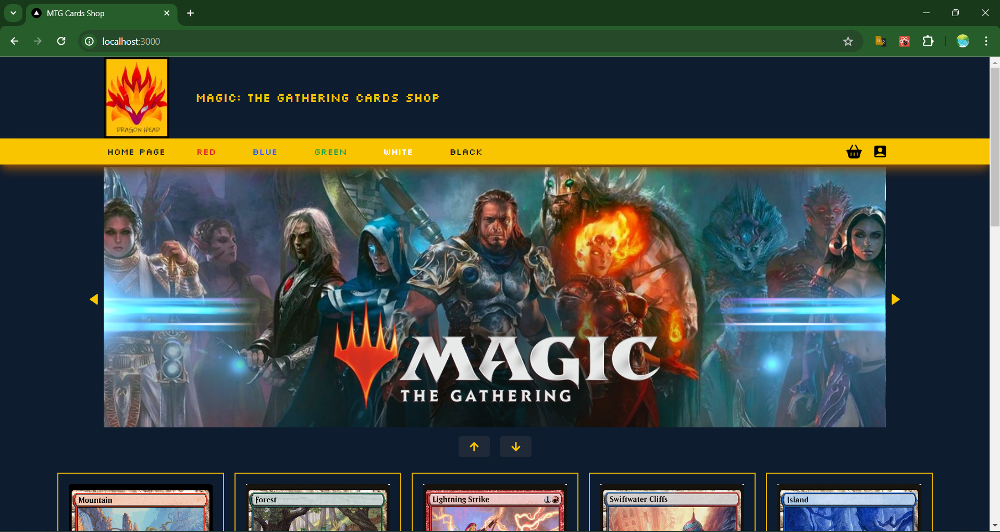
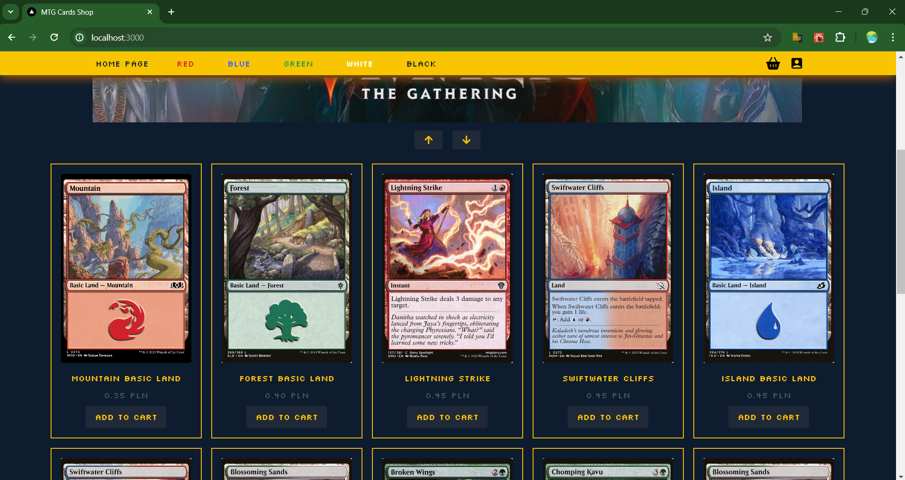
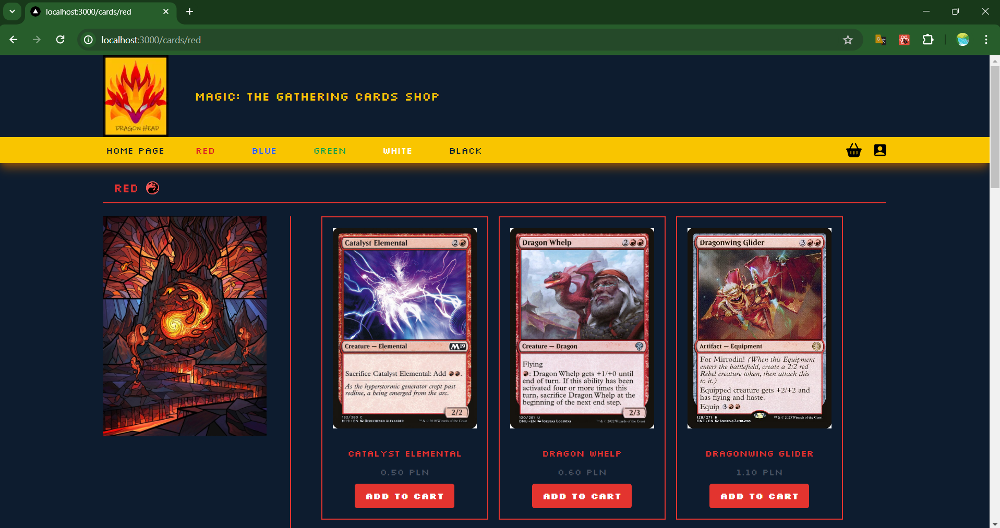

# MTG-Cards-Shop-Project--Code-Review-Only

The application is under development. I'm currently working on refactoring the code and securing the data before adding it to the server. 

In this repository I have added read-only code to serve as an example of the current state of my application. After code refactorization and data securing, the application will be deployed to the server and the github repositories will be updated. This may take a few days as I want to deliver the entire project in the best possible condition according to best development practices and clean code.

Application Description:

Full Webstack Application created as an e-commerce store managing the sale of Magic: The Gathering playing cards. The application supports the processes of ordering cards, logging in and registering users. It also supports user account confirmation emails. 
All processes take place through communication between the server and the presentation layer. All orders details are saved in the database for registered users and those placing orders without registration. The presentation UI responds dynamically to changes made by the user. During the ordering, login or registration process, user data is validated and the UI reacts to everything dynamically.

In terms of media support, the app uses the Google Drive API to download any media in .png format located in my Google Drive. This way, all media is stored in the cloud rather than locally on disk. The database only stores parts of the entire URL for downloading media via a given fileName or file_ID.

Technologies used:

- IntellliJ Idea,
- Visual Studio Code,
- Node.js,
- Java 17,
- Maven,
- Spring Framework,
- Spring Security,
- Lombok,
- JPA,
- CORS,
- Rest API architecture,
- Google Drive API,
- MySQL/Workbench,
- React,
- React Redux,
- Next.js,
- Tailwind CSS.

More info soon! Also in moment I will upload some application pictures.

## Application Screenshots

Here are some screenshots of the application:

### Screenshot 1

### Screenshot 2

### Screenshot 3

